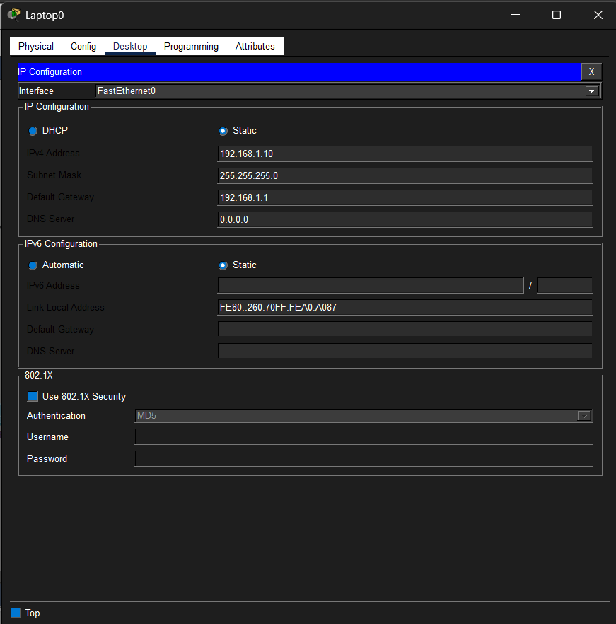
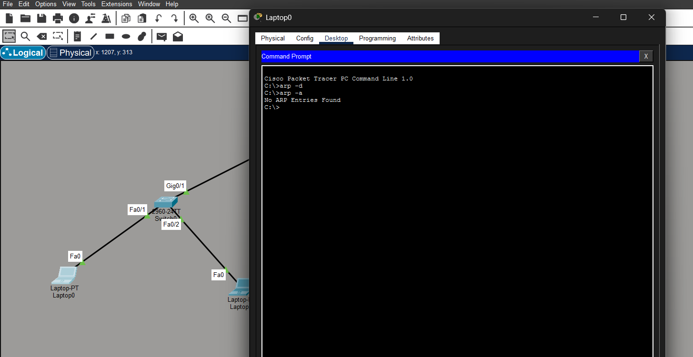
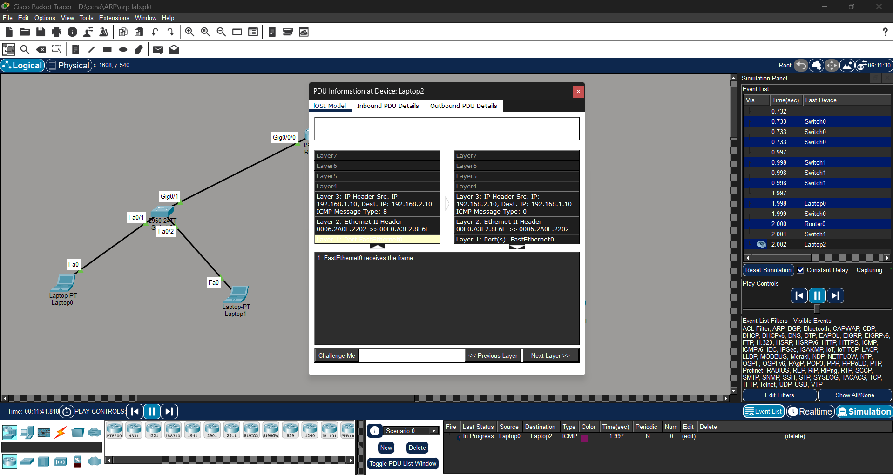
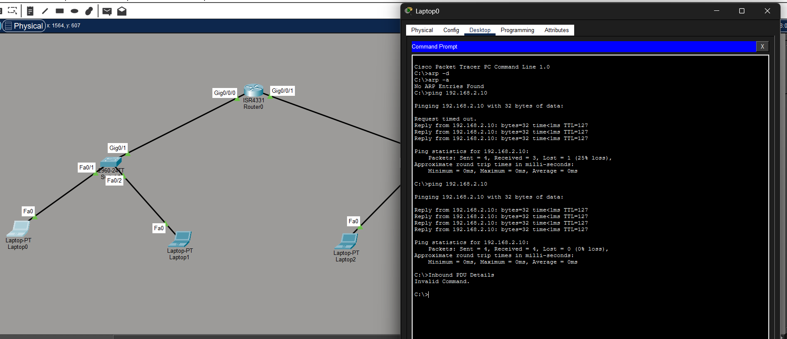
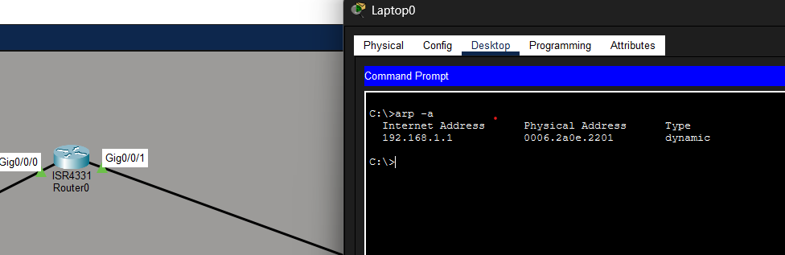
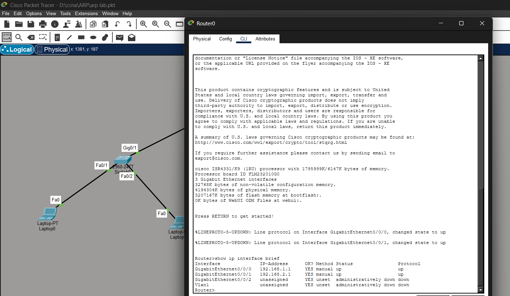
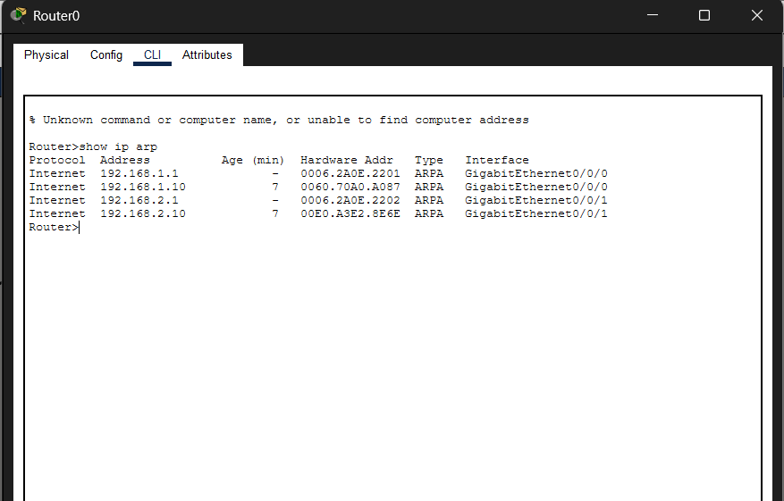
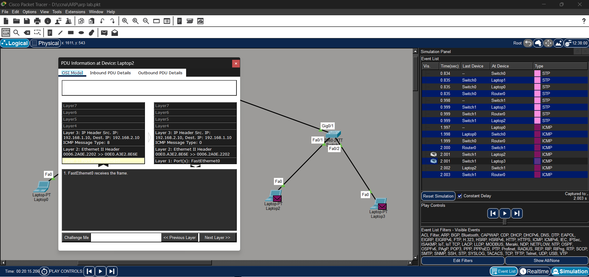

# 🌐 Address Resolution Protocol (ARP) Lab


---

# 📖 Overview

This lab demonstrates how the Address Resolution Protocol (ARP) works in a Local Area Network (LAN) and across different subnets using a Cisco Router.

The lab was created using Cisco Packet Tracer as part of my CCNA practical learning journey.

---

# 🎯 Objectives

- Understand ARP Request
- Understand ARP Reply
- Learn ARP Cache
- Observe ARP using Simulation Mode
- Verify Router ARP Table
- Understand why ARP does not cross routers

---

# 🛠 Lab Topology

> **Network Topology**


---

# 🌍 Network Design

```
                 LAN 1

Laptop0 -------- Switch -------- Router -------- Switch -------- Laptop2
      \                                           \
       \                                           \
      Laptop1                                     Laptop3

                 LAN 2
```

---

# 🖥 IP Addressing

| Device | IP Address | Subnet Mask | Default Gateway |
|---------|------------|-------------|-----------------|
| Laptop0 | 192.168.1.10 | 255.255.255.0 | 192.168.1.1 |
| Laptop1 | 192.168.1.20 | 255.255.255.0 | 192.168.1.1 |
| Router G0/0 | 192.168.1.1 | 255.255.255.0 | - |
| Router G0/1 | 192.168.2.1 | 255.255.255.0 | - |
| Laptop2 | 192.168.2.10 | 255.255.255.0 | 192.168.2.1 |
| Laptop3 | 192.168.2.20 | 255.255.255.0 | 192.168.2.1 |

---

# ⚙ Router Configuration

```cisco
enable

configure terminal

interface GigabitEthernet0/0/0
 ip address 192.168.1.1 255.255.255.0
 no shutdown

interface GigabitEthernet0/0/1
 ip address 192.168.2.1 255.255.255.0
 no shutdown

end

write memory
```

---

# 📌 Commands Used

```bash
arp -a

arp -d

ping 192.168.2.20

show ip arp

show ip interface brief
```

---

# 🔍 Lab Verification

## 1️⃣ IP Configuration



---

## 2️⃣ Empty ARP Cache

```bash
arp -a
```

Output:

```
No ARP Entries Found
```



---

## 3️⃣ ARP Request

When the MAC address is unknown, the sender broadcasts an ARP Request.



---

## 4️⃣ Successful Ping

After ARP resolution completes, the ping succeeds.



---

## 5️⃣ ARP Cache After Communication

The sender stores the MAC address of the default gateway in its ARP cache.



---

## 6️⃣ Router Interface Configuration



---

## 7️⃣ Router ARP Table

Verify using:

```bash
show ip arp
```



---

## 8️⃣ Packet Flow

Simulation Mode confirms the packet sequence.



---

# 📚 Key Learnings

- ARP maps IPv4 addresses to MAC addresses.
- ARP Request is a Layer 2 Broadcast.
- ARP Reply is Unicast.
- ARP works only inside the local broadcast domain.
- Routers do not forward ARP broadcasts.
- Devices communicate with remote networks through the MAC address of the default gateway.

---

# 💼 Interview Questions

### What is ARP?

ARP (Address Resolution Protocol) resolves an IPv4 address to a MAC address.

---

### Why is ARP needed?

Because Ethernet communication requires MAC addresses, while applications use IP addresses.

---

### Why doesn't ARP cross a router?

Routers separate broadcast domains and do not forward Layer 2 broadcasts.

---

### Which command displays the ARP table?

```bash
show ip arp
```

---

### Why does Laptop0 only learn the MAC address of 192.168.1.1?

Because the destination (192.168.2.20) is on another subnet, so Laptop0 sends traffic to its default gateway.

---

# 📁 Files Included

- ARP-Lab.pkt
- README.md
- Packet Tracer Screenshots

---

# 🏁 Conclusion

This lab demonstrates the complete ARP workflow, including ARP Request, ARP Reply, ARP Cache, router ARP processing, and communication between different subnets using a Cisco Router.

---

# 👨‍💻 Author

**Rahul Bagaria**

- CCNA Student
- Networking Enthusiast
- Cybersecurity Learner

⭐ If you found this repository useful, consider giving it a **Star**.
